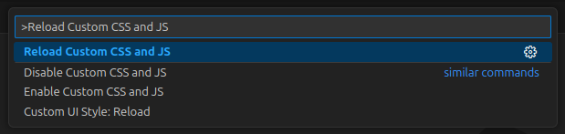

## Move the window controls in VSCode on Linux to the left


This script moves the window controls (close, minimize, and maximize buttons) to the left. 

* **Shape was created in a similar form to the Whitesur theme.**  
* The above preview additionally uses the [hide-vscode-icon](https://marketplace.visualstudio.com/items?itemName=BuldiDev.hide-vscode-icon) extension.

<br />   
   
> [!CAUTION]
> This script method only works on VSCode versions 1.97.2 and earlier, so you should intentionally use an older version.

<br />   
  
### Installation
First, you need to install the [vscode-custom-css](https://marketplace.visualstudio.com/items?itemName=be5invis.vscode-custom-css) extension from the VSCode Extension Marketplace.

Open the ~/.config/Code/User/settings.json file in VSCode and add the following configuration:
```json
{
    ... (If there is content before, write it at the very bottom) ...
    // Change were this script is located
    "vscode_custom_css.imports": ["https://raw.githubusercontent.com/inasis/vscode-controls-linux/refs/heads/main/script.js"],

    // Needed to change to custom style
    "window.titleBarStyle": "custom",
    "window.experimentalControlOverlay": false,

    // for VSCode >= 1.104
    "window.controlsStyle": "custom",
}
```
<br />   

### Set and apply permissions
Grant the extension permission to modify system files by running the command below in Terminal:
```sh
# Run VSCode in sudo
sudo chown -R $(whoami) "$(which codium 2>/dev/null || which code)"
sudo chown -R $(whoami) /usr/share/$(which codium &>/dev/null && echo "codium" || echo "code")
```
<br />   

### Final process
Launch VSCode and Open the Command Palette (Ctrl+Shift+P).  
Search for and run "Reload Custom CSS and JS."  

  
<br />   

After restarting VSCode, the window controls will move to the left.
